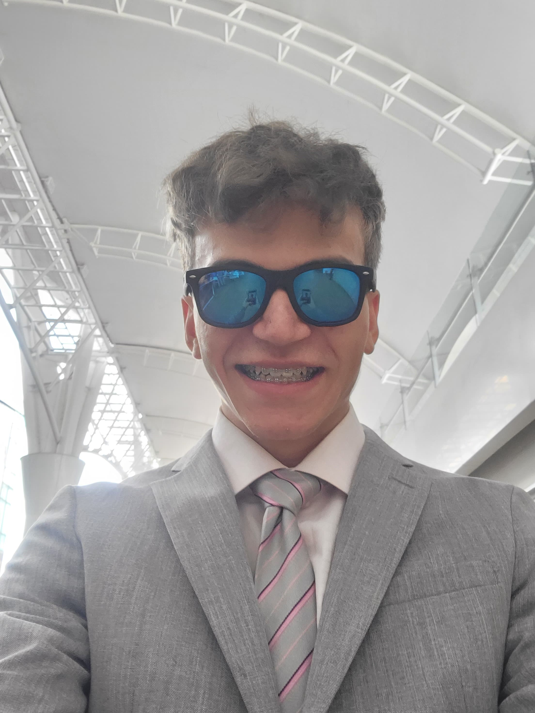
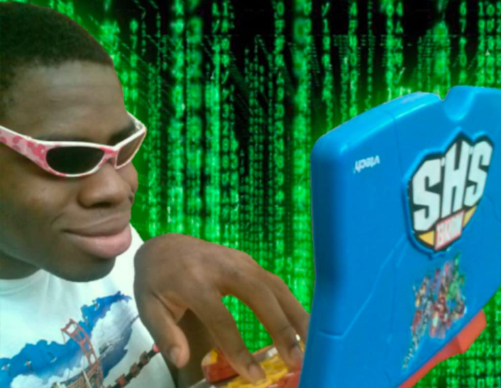

# JavideuS <33333333 
# Heyyy, I'm Javi😎

<table style="width:100%; border-collapse: collapse; border: none;">
  <tr>
    <td style="width:70%; padding: 10px; border: none;">
      <h1 style="font-size: 24px; font-weight: bold;">I'm just a computer and robotics enthusiast who wants to do cool stuff</h1>
      
This is where I upload all my freestyle codes and attempts to change the world during my free time.

      
I believe that open-source code is important to the development of the world, so I always will try to update with every new idea I get in mind.

    </td>
    <td style="width:30%; padding: 10px; border: none;">
      
    </td>
  </tr>
</table>

## About Me

<table style="width:100%; border-collapse: collapse; border: none;">
  <tr>
    <td style="width:60%; padding: 10px; border: none;">
      <ul style="font-size: 18px; text-align: justify;">
        <li>🇻🇪 I was born in Caracas and I'm currently living in Spain, but my dream is to live in Seoul</li>
        <li>👻 I like to freestyle with my code and try a bunch of stuff to get fun, maybe one day it is a crazy invention that changes the world</li>
        <li>⚡ Fun fact: Me gustan las rubias 😼, el lol 🎮, Fnatic, el Real Madrid ⚽ y las NewJeans 🤩</li>
        <li>My role model is Iron Man and someday I will replicate his achievements 🤖</li>
      </ul>
    </td>
    <td style="width:40%; padding: 10px; border: none;">
      
    </td>
  </tr>
</table>

## Skills

<table style="width:100%; border-collapse: collapse; border: none;">
  <tr>
    <td style="width:65%; padding: 10px; border: none;">
      <ul style="font-size: 18px;">
        <li><strong>Dedicated Fields:</strong> Robotics and AI</li>
        <li><strong>Programming Languages:</strong> C++, Python, Java</li>
        <li><strong>Tools:</strong> Freecad</li>
        <li><strong>Languages:</strong> Spanish, English, and Korean Enthusiast</li>
      </ul>
    </td>
    <td style="width:35%; padding: 10px; border: none;">
      
    </td>
  </tr>
</table>

<!--

## Projects

Here are some of the projects I've worked on:

### [Project Name 1](https://github.com/your-username/project1)
A brief description of what this project does and why it's useful.

### [Project Name 2](https://github.com/your-username/project2)
A brief description of what this project does and why it's useful.

-->
## Contact

- [Instagram](https://www.instagram.com/javig1000/)
- [LinkedIn](https://www.linkedin.com/in/javideus/)

